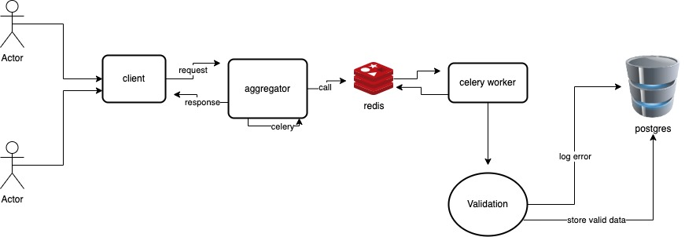

# User behavior storage service with Django-Rest-Framework and Celery
This project aims to provide an event aggregator for user actions on a generic client web. With this goal in mind, the service stores the user interaction and responds to the client's web as fast as possible.

The diagram shows the data flow:  



The aggregator receives the client request, stores the request body, and returns a success message. This approach guarantees a reduction in the communication time between the client and the aggregator since all the data validation, database storage, and log errors will occur later on in the process.  


The data treatment validates the event based on the vital info: _name_, _category_, _session_id_, _timestamp_, and _data_. After that, the payload validation starts using the event _name_ and _category_ to determine which class should validate the content and insert it into the DB. 


IF any validation error occurs during these steps, the system creates a new error log with the event data and the validation errors in the database.

## How to set up the environment?

> **⚠ WARNING: **  
> Make sure that you have docker and docker-compose installed on your machine!!

1. Clone this repository.
2. Create a virtualenv with Python 3.9.
3. Activate the virtualenv.
4. Install the requirements.
5. Generate the project **Secret Key**.
6. Set up the instance with .env _(Make sure that you changed the environment variables to math with your settings.)_
7. Export the Database Username and Password
8. Create a database data directory
9. Build the Images
10. Start up the services
11. Create the super admin user
12. Run the tests

```console
git clone https://github.com/jrenato7/drf_celery.git
cd drf_celery/
python3 -m venv venv/
source venv/bin/activate
cd drf_celery/
pip install -r requirements.txt
python ../contrib/secret_gen.py
cp ../contrib/env-sample .env
export SQL_USER=the_user_db
export SQL_PASSWORD=my562pgsql839password
mkdir -p data/celery_db/
make build
make run
docker-compose exec web python manage.py createsuperuser
docker-compose exec web python manage.py test
```

## How to use:

You should be able to send data to the service by the URL: http://localhost:5050/event/

The system has an _admin_ area available on the URL: http://localhost:5050/admin/. In the _admin_ area is possible to see the error logs and the events created successfully.

### Insomnia/Postman
You can connect to the API by adding the settings on the insomnia/postman app:

**Push a new event**

Request method: _POST_

URL: _http://localhost:5050/event/_

Header: _Accept: 'application/json'_

Request body:
```console
{
  "session_id": "d66ac88b-f801-4984-953f-5c6b266494a0",
  "category": "page interaction",
  "name": "link click",
  "data": {
    "host": "www.cwtech.dev",
    "path": "/",
    "element": "register"
  },
  "timestamp": "2022-04-01 09:15:27.243860"
}
```

The categories and names available are:

```console
"category": "page interaction", "name": "pageview" 
```
_used when a new page is loaded._

```console
"category": "page interaction", "name": "* click" 
```
_used when the user clicks on any element in the page._

```console
"category": "form interaction", "name": "submit" 
```
_used when the user submit the form._